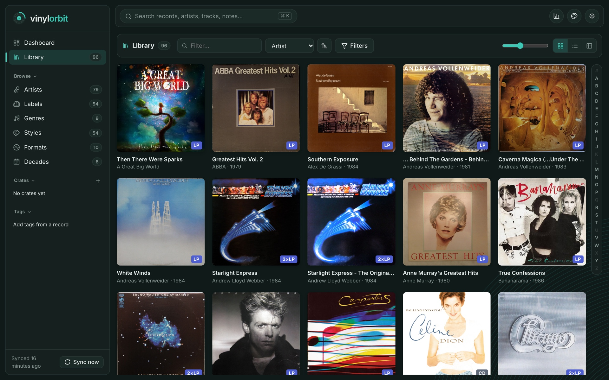
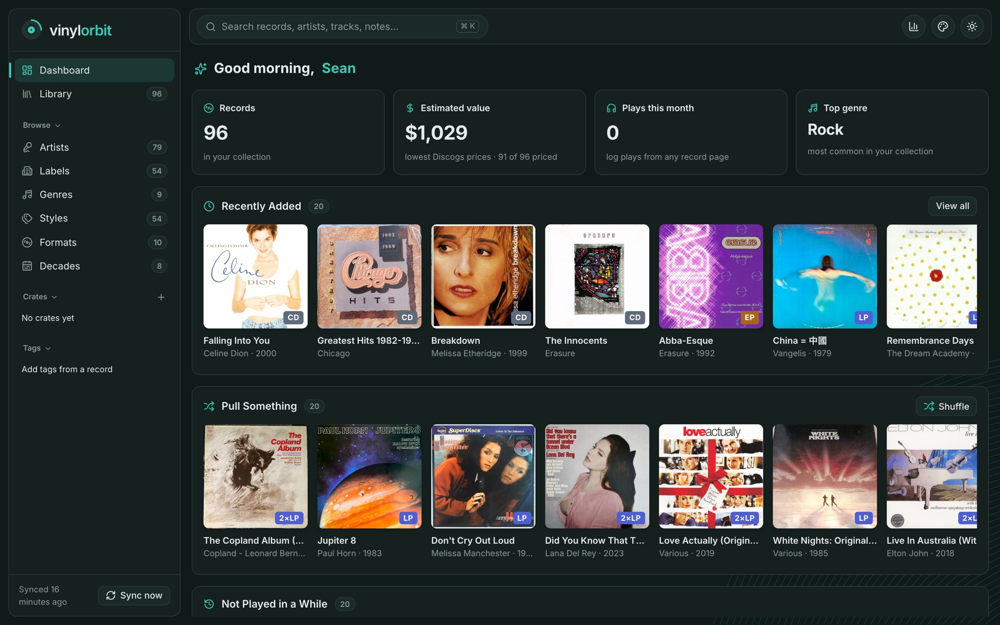
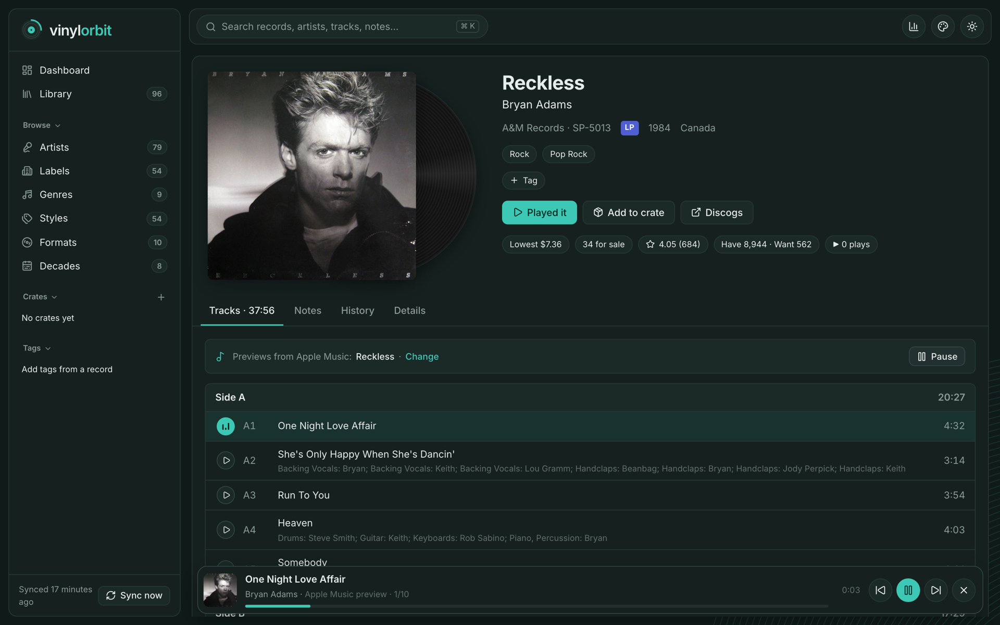
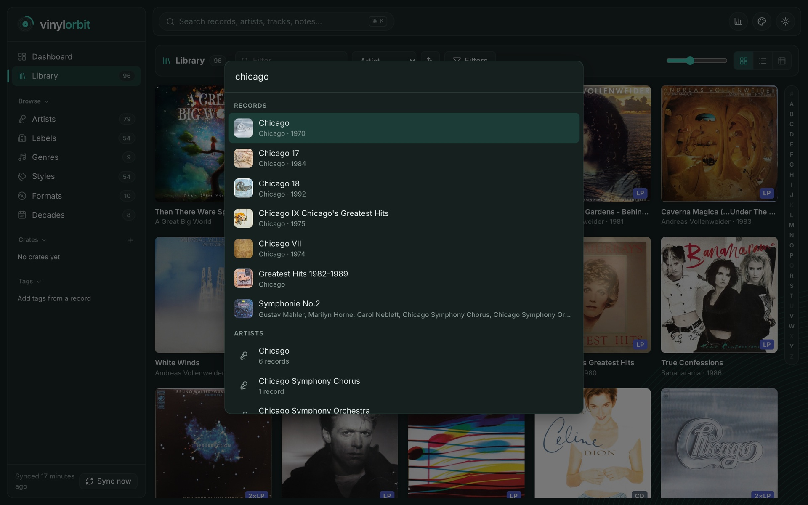
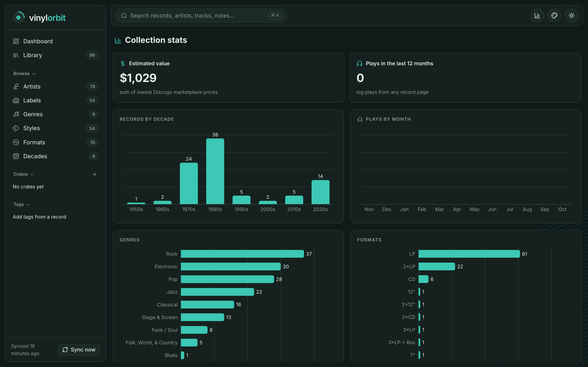
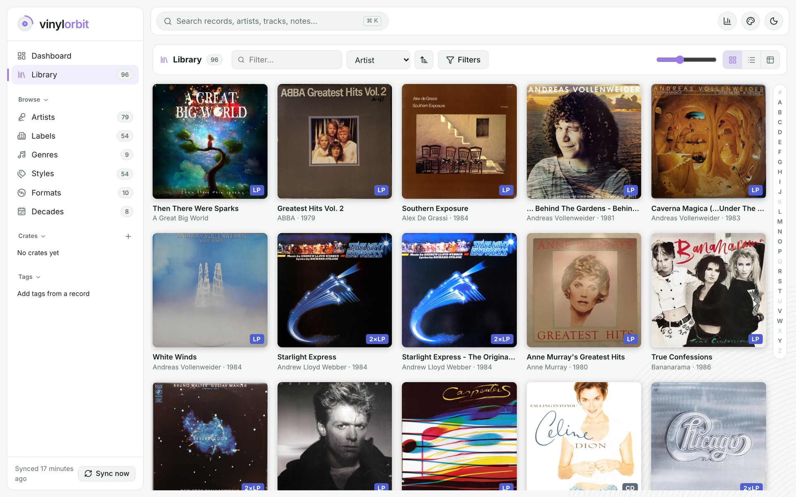
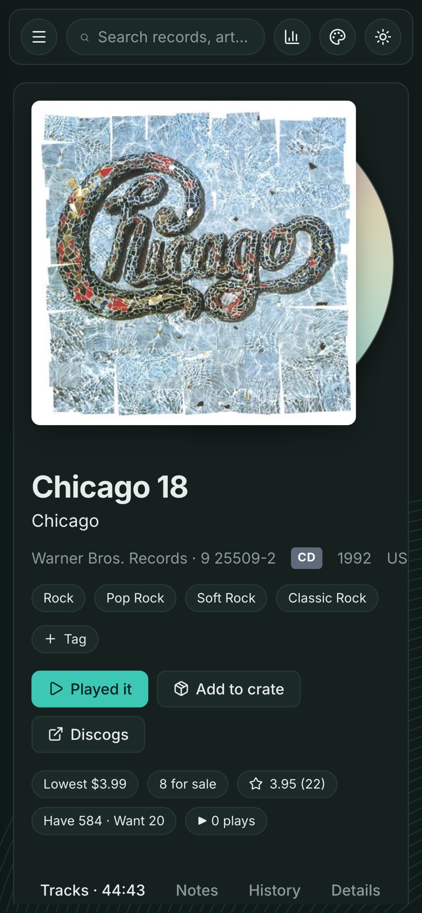

# Vinyl Orbit

A self-hosted browser for your public Discogs collection: a cover-grid library with filters and an A–Z rail, large cover lightbox, side-by-side tracklists, credits and identifiers, 30-second Apple Music previews of every track with a mini-player that keeps playing while you browse, plus things Discogs doesn't do well — Markdown notes, personal tags, crates, a listening log, and price history.

Everything runs in one Docker container: a Node/Fastify server that syncs from the Discogs API into SQLite and serves a React app on port **3020**.

Vinyl Orbit is based on the amazing work of [neonsolstice](https://github.com/neonsolstice) and the [BookOrbit](https://github.com/bookorbit/bookorbit) app.



## Screenshots

| | |
|---|---|
|  **Dashboard**: collection value, recently added, and records to pull |  **Release page**: tracklist with Apple Music previews and a mini-player |
|  **Search (⌘K)**: records, artists, tracks and notes |  **Stats**: decades, genres, formats and plays |
|  **Light theme and accent colours** |  **Mobile**: works on phones too |

## Install on your Docker machine (step by step)

Everything below is typed on the machine that runs Docker (e.g. over SSH). It takes about 5 minutes plus a few minutes for the first sync.

### 1. Check the machine has Docker and Git

```bash
docker --version
docker compose version
git --version
```

Each should print a version. If `docker compose version` fails, install the Docker Compose plugin (on most Linux distros: `sudo apt install docker-compose-plugin`). If `git` is missing: `sudo apt install git`. If Docker commands say *permission denied*, either put `sudo` in front of them or add yourself to the docker group (`sudo usermod -aG docker $USER`, then log out and back in).

### 2. Download Vinyl Orbit

Pick a folder to keep it in (your home folder is fine), then:

```bash
cd ~
git clone https://github.com/seanbaugh/vinyl_orbit.git
cd vinyl_orbit
```

All remaining commands are run from inside this `vinyl_orbit` folder.

### 3. Create your settings file

```bash
cp .env.example .env
nano .env
```

Check these lines, save with **Ctrl+O, Enter**, and exit with **Ctrl+X**:

- `DISCOGS_USERNAME=seanmikel` — the Discogs account to show (must have a public collection).
- `TZ=America/Los_Angeles` — your time zone ([list of names](https://en.wikipedia.org/wiki/List_of_tz_database_time_zones), e.g. `America/New_York`, `Europe/London`).
- Leave everything else as is. `DISCOGS_TOKEN` is optional (it only makes syncing faster).

### 4. Build and start it

```bash
docker compose up -d --build
```

The first build downloads and compiles everything and takes a few minutes. When it finishes, check it's running:

```bash
docker compose ps
```

The `vinyl-orbit` row should say `Up` (after ~30 seconds it also says `healthy`).

### 5. Open it

Find the machine's IP address:

```bash
hostname -I
```

(On a Mac host use `ipconfig getifaddr en0` instead.) Use the first address shown (e.g. `192.168.1.217`) and open **`http://<that-address>:3020`** in a browser on any device on your network.

The first sync starts automatically: records appear within a minute, and tracklists, prices and covers fill in over about 4–5 minutes for ~100 records. Progress is shown at the bottom of the sidebar.

### Everyday commands (run inside the `vinyl_orbit` folder)

| What | Command |
|---|---|
| See the logs | `docker compose logs -f vinyl-orbit` (Ctrl+C to stop watching) |
| Stop | `docker compose down` |
| Start again | `docker compose up -d` |
| Update to the latest version | `git pull && docker compose up -d --build` |
| Restart | `docker compose restart` |

It restarts automatically after a reboot (`restart: unless-stopped`).

### Your data and backups

Everything lives in the `data/` folder next to `docker-compose.yml`:

- `data/library.db` — your notes, tags, crates, plays, preview matches **and** the synced Discogs data. **This is the file to back up.**
- `data/images/` — cached cover art (re-downloaded automatically if lost).

Back up: `cp data/library.db ~/library-backup-$(date +%F).db` (safest while stopped: `docker compose down` first, then `docker compose up -d`).
Restore: stop it, copy the backup over `data/library.db`, start it.

Updating with `git pull` never touches `data/`.

### Troubleshooting

- **Page doesn't load** — run `docker compose ps` (is it `Up`?) and `docker compose logs --tail 50 vinyl-orbit`. Make sure you used `http://` (not https) and port `3020`.
- **"port is already allocated"** — something else uses 3020. Edit `docker-compose.yml`, change `"3020:3020"` to e.g. `"3030:3020"`, run `docker compose up -d`, and open port 3030 instead.
- **No records after a few minutes** — check `DISCOGS_USERNAME` in `.env` and that the collection is public on Discogs; after editing `.env`, run `docker compose up -d` to apply it. The sidebar shows the last sync error.
- **"Previews unavailable right now"** — Apple Music didn't answer; click Retry a minute later.
- **Build fails on a Raspberry Pi / ARM** — make sure you're on a 64-bit OS; the build compiles a small native module and needs ~1 GB of free RAM.

## Configuration (`.env`)

| Variable | Default | Purpose |
|---|---|---|
| `DISCOGS_USERNAME` | `seanmikel` | Whose public collection to sync |
| `DISCOGS_TOKEN` | *(empty)* | Optional personal token — faster syncs (60 req/min). Discogs → Settings → Developers → Generate token |
| `TZ` | `America/Los_Angeles` | Your time zone, used for month boundaries in play stats |
| `SYNC_INTERVAL_HOURS` | `6` | How often to sync automatically (`0` = only on startup / "Sync now") |
| `DETAIL_REFRESH_DAYS` | `7` | Re-fetch prices and ratings for a record after this many days |
| `DETAIL_REFRESH_PER_RUN` | `15` | Max out-of-date records refreshed per scheduled sync (spreads the load) |
| `CURRENCY` | `USD` | Marketplace price currency |
| `PREVIEW_COUNTRY` | `US` | Apple Music storefront used for 30-second track previews |

New records are always fetched in full on the next sync. **Sync now** in the sidebar refreshes everything that's out of date immediately.

## How syncing treats your data

- Discogs data (titles, tracklists, prices…) is overwritten on each sync.
- Your notes, tags, crates and plays are never touched by a sync.
- If you remove a record from your Discogs collection it's hidden, not deleted — add it back and its notes and plays reappear.

## Show it on your TV (AirPlay)

- On your Mac open Control Center → **Screen Mirroring** and pick your Apple TV.
- Open a record and press **Spin now** (it also logs a play), or play a preview and press **Spinning now** (⌘⇧S) in the top bar or mini-player.
- The TV shows the cover large beside a spinning record, or a silver CD for CDs. Controls fade out after a few seconds; **Esc** leaves.

## How track previews work

- The first time you open a record's Tracks tab, Vinyl Orbit looks it up on Apple Music (free iTunes Search API, no account needed), picks the closest album, and matches each track by title. Tracks it can't place get a per-track search. The result is saved, so later visits are instant.
- Press ▶ on any track, or **Preview album**, and the clips play in the mini-player at the bottom — it keeps going while you browse. Media keys work too.
- Wrong album? Click **Change** above the tracklist to pick another, turn previews off for that record, or reset to automatic. Your choice is kept across syncs and restarts.
- Spotify no longer offers preview clips through its API, so previews come from Apple Music only.

## Develop (no Docker needed)

Requires Node 22.

```bash
npm install
npm run dev        # API on :3020 (data in ./data), web on :5173 with hot reload
npm test           # server + web tests
npm run build      # production build; then: DATA_DIR=./data node server/dist/main.js
```

Layout: `server/` (Fastify, better-sqlite3, sync engine, JSON API under `/api`), `web/` (React, Vite, TanStack Query), shared response types in `server/src/api-types.ts`.

## Credits

This app is based on the amazing work of [neonsolstice](https://github.com/neonsolstice) and the [BookOrbit](https://github.com/bookorbit/bookorbit) app. Vinyl Orbit takes BookOrbit's look and layout and adapts them for a Discogs record collection. The full-screen view's type is [Clarity City](https://fonts.google.com/specimen/Clarity+City) (SIL Open Font License, bundled in `web/public/fonts`).
